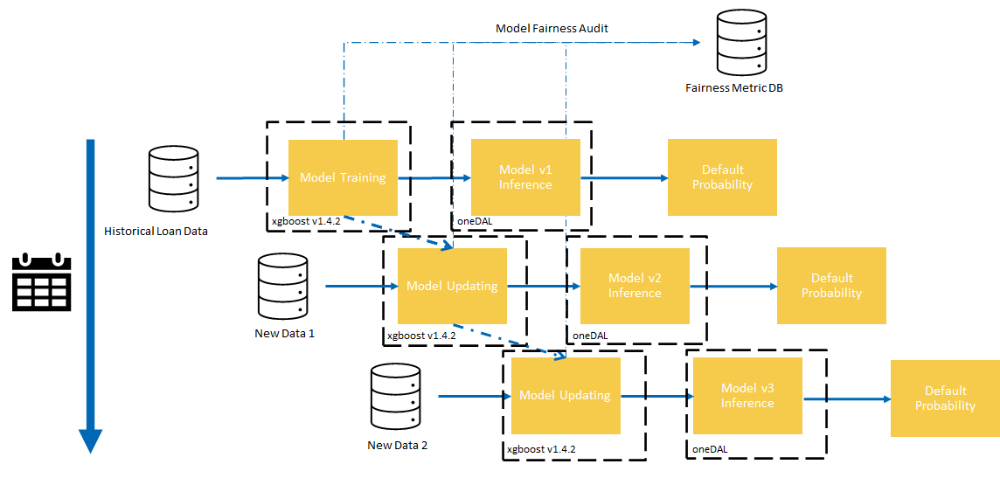

# **Loan Default Risk Prediction using XGBoost**
## **Table of Contents**
 - [Purpose](#purpose)
 - [Reference Solution](#reference-solution)
 - [Reference Implementation](#reference-implementation)
 - [Intel® Optimized Implementation](#optimized-e2e-architecture-with-intel%C2%AE-oneapi-components)
 - [Performance Observations](#performance-observations)
 - [Experimental Setup](#experimental-setup)

## Purpose

US lenders issue trillions of dollars in new and refinanced mortgages every year, bringing the total mortgage debt to very high levels year after year. At the same time, mortgage delinquencies usually represent a significant percentage, representing a huge debt risk to the bearer. In order for a Financial Organization to its risk profile, it is pivotal to build a good understanding of the chance that a particular debt may result in a delinquency. Organizations are increasingly relying on powerful AI models to gain this understanding and using that to build powerful tools for predictive analysis. However, these models do not come without their own set of complexities. With expanding and/or changing data, these models must be updated to accurately capture the current environment in a timely manner. Furthermore, as loan prediction systems are highly impactful from a societal point of view, it is no longer enough to build models that only make accurate predictions. Fair predictions are required to build an ethical AI, which could go a long way for an organization to build trust in their AI systems.

## Reference Solution

In this reference kit, we provide a reference solution for training and utilizing an AI model using XGBoost to predict the probability of a loan default from client characteristics and the type of loan obligation. We also demonstrate how to use incremental learning to update the trained model using brand new data. This can be used to correct for potential data drift over time as well to avoid re-training a model from full data via which may be a memory intensive process. Finally, we will provide a brief introduction to a few tools that can be used for an organization to analyze the fairness/bias that may be present in each of their trained models. These can be saved for audit purposes as well as to study and adjust the model for the sensitive decisions that this application must make.

## Key Implementation Details

The reference kit implementation is a reference solution to the described use case that includes:

  1. A reference E2E architecture to arrive at an AI solution with an XGBoost classifier
  2. An Optimized reference E2E architecture enabled with Intel® optimizations for XGBoost and Intel® daal4py

## Reference Implementation

### E2E Architecture


### Expected Input-Output

**Input**                                 | **Output** |
| :---: | :---: |
| Client Features         | Predicted probability between [0,1] for client to default on a loan |

**Example Input**                                 | **Example Output** |
| :---: | :---: |
| ***ID***, ***Attribute 1***, ***Attribute 2*** <br> 1, 10, "X" <br> 2, 10, "Y" <br> 3, 2, "Y" <br> 4, 1, "X" | [{'id' : 1 , 'prob' : 0.2}, {'id" : 2', 'prob' : 0.5}, {'id' : 3, 'prob' : 0.8}, {'id' : 4, 'prob' : 0.1} |9


### Dataset

The dataset used for this demo is a set of 32581 simulated loans. It has 11 features including customer and loan characteristics and one response which is the final outcome of the loan. It was sourced form https://www.kaggle.com/datasets/laotse/credit-risk-dataset.

**Feature** | **Description** |
| :---: | :---: |
| person_age | Age of client |
| person_income | Income of client |
| person_home_ownership | Whether the client owns a home |
| person_emp_length | Length of the clients employment in years |
| loan_intent | The purpose of the loan issued |
| loan_grade | The grade of the loan issued |
| loan_amnt | The amount of the loan issued |
| loan_int_rate | The interest rate of the loan issued |
| loan_percent_income | Percent income |
| cb_person_default_on_file | Whether the client has defaulted before |
| cb_person_cred_hist_length | The length of the clients credit history |
| **loan_status** | Whether this loan ended in a default (1) or not (0)

For demonstrative purposes we make 2 modifications to the original dataset before experimentation using the the [`data/prepare_data.py`](data/prepare_data.py) script

1. Adding a synthetic bias_variable
    
    For the purpose of demonstrating fairness in an ML model later, we will add a bias value for each loan default prediction. This value will be generated randomly using a simple binary probability distribution as follows:
    ```

    If the loan is defaulted i.e. prediction class 1:
      assign bias_variable = 0 or 1 with the probability of 0 being 0.65

    if the loan is not defaulted i.e. prediction class 0:
      assign bias_variable = 0 or 1 with the probability of 0 being 0.35
      
    ```
    **Feature** | **Description** |
    | :---: | :---: |
    | bias_variable | synthetic biased variable |

    For fairness quantification, we will define that this variable should belong to a [protected class](https://en.wikipedia.org/wiki/Fairness_(machine_learning)) and `bias_variable = 1` is the privileged group.

    This variable is NOT used to train the model as the expectation is that it should not be used to make decisions for fairness purposes.

2.  Splitting the dataset into 1 initial batch for training the model from scratch, and 3 additional equally sized batches for incrementally updating the trained model 
    
    To simulate the process of incremental learning, where the model is updated on new datasets, the original training set is split into 1 batch for initially training the model from scratch, and then 3 more equally sized batches for incrementally learning.  When running incremental learning, we will be using each batch to represent a new dataset that will be used to update the model..   

The final process for splitting this dataset is first, 70% for training and 30% for holdout testing.  Following this, the 70% is split as described above into 1 batch for initial training and 3 for incremental training. 

**To download and setup this dataset for benchmarking, follow the instructions listed in the data directory [here](data/README.md).**

> **Please see this data set's applicable license for terms and conditions. Intel Corporation does not own the rights to this data set and does not confer any rights to it.**

### Model Training & Incremental Learning

The first step to build a default risk prediction system is to train an ML model.  In this reference kit, we choose to use an XGBoost classifier on the task of using the features for a client and loan, and outputting the probability that the loan will end in a default.  This can then be used downstream when analyzing whether a particular client will default across many different loan structures in order to reduce and analyze risk to the organization.  XGBoost classifiers have been proven to provide excellent performance when dealing with similar predictive tasks such as fraud detection and predictive health analytics.  

In addition to simply training a new model, we will also demonstrate, in this implementation guide, how this model can be updated with new data using an incremental learning approach.  Incremental learning is the process of updating an existing trained model with brand new data without re-using the old data that the model was originally built with.

In many situations, an incremental approach is desirable.  Some scenarios may include:

1. **Data Shift**
   
   With data shift, the historical data that the original model was trained on becomes stale due to changes in the environment which could affect the data distribution.  In this case, the old model may make poor predictions on new data, however, certain characteristics that the model previously learned can still be useful and it's not preferable to train an entirely new model on new data.  

2. **Large Datasets**
   
    Incremental learning can also help when datasets become too large, and it becomes cumbersome to train a model on all of the data available.  In this case, updating an existing model with batches can lead to substantially reduced training times, allowing for more exploration and hyper-parameter tuning. 


#### Data Pre-Processing

Before passing the data intothe model, we transform a few of the features in the dataset using `sklearn` pipelines to obtain better performance.  

1. Categorical Features to One-Hot Encodings
  `person_home_ownership`, `loan_intent`, `loan_grade`, `cb_person_default_on_file` are all transformed to use a One-Hot Encoding to be fed into the XGBoost classifier
2. Imputation of Missing Values
  `loan_int_rate`, `person_emp_length`, `cb_person_cred_hist_length` are all imputed using the Median value to fill in any missing values that may be present in collection of the dataset.
3. Power Transformation of Numerical Features
  `person_age`, `person_income`, `loan_amnt`, `loan_percent_income` are all transformed using a power transformation to reduce variance and make the distributions more Gaussian.

### Fairness Evaluation

In many situations, accuracy is not the only consideration for deploying a model to production.  For certain sensitive applications, it is also necessary to verify and quantify to what degree a model may be using information to make biased predictions, which may amplify certain inequities.  This study can broadly be defined as understanding the bias and fairness of a machine learning model, which is an [actively developing field of research in ML](https://arxiv.org/pdf/1908.09635.pdf).  

To accommodate this challenge, in this reference kit, we will demonstrate the computation of a few metrics to quantify the fairness of predictions, focusing on parity between the privileged and the non-privileged groups in our previously introduced `bias_variable`.  Briefly, under parity constraints, the computed metrics should be independent of the protected variable, largely performing the same whether measured on the privileged or non-privileged subgroups.  A more through discussion of parity measures for fairness can be found in the link above as well as [here](https://afraenkel.github.io/fairness-book/content/05-parity-measures.html).

Computationally, after a model is trained or updated, we will report the following *ratios predictive metrics for the privileged and non-privileged groups* on a hold out test set

- **positive predictive value (PPV)**
- **false discovery rate (FDR)**
- **negative predictive value (NPV)**
- **false omission rate (FOR)**
- **true positive rate (TPR)**
- **false negative rate (FNR)**
- **true negative rate (TNR)**
- **false positive rate (FPR)**

As described above, under parity considerations, for these metrics to be independent of the protected variable, the ratio of these values should be around 1.0.  Significant deviations above or below 1.0 may indicate bias that needs to be further investigated.

### Model Inference

The saved model from each model iteration can be used on new data with the same features to infer/predict the probability of a default.  This can be deployed in any number of ways.  When the model is updated on new data, the deployed model can be transitioned over to the new model to make updated inferences given that performance is better and that the model meets the standards of the organization at hand.

### Software Requirements

1. Python v3.9
2. XGBoost v0.81

To run this reference kit, first clone this repository, which can be done using

```shell
git clone https://www.github.com/oneapi-src/loan-default-risk-prediction
```

This reference kit implementation already provides the necessary scripts to setup the above software requirements. To utilize these environment scripts, first install Anaconda/Miniconda by following the instructions at the following link

https://docs.conda.io/projects/conda/en/latest/user-guide/install/index.html


### Reference Solution Setup

On Linux machines `setupenv.sh` can be used to automate the creation of a conda environment for execution of the algorithms using the statements below.

```shell
bash setupenv.sh
1. stock
2. intel
? 1
```

This script utilizes the dependencies found in the `env/stock/stock.yml` file to create an environment as follows:

**YAML file**                                 | **Environment Name** |  **Configuration** |
| :---: | :---: | :---: |
| `env/stock/stock.yml`             | `defaultrisk_stock` | Python=3.9.x with XGBoost 0.81 |

For the workload implementation to arrive at first level reference solution we will be using the stock environment

If working on Windows, a conda environment can be manually created using the Anaconda prompt from the root directory by running the following command:

```shell
conda env create -n defaultrisk_stock -f env/stock/stock.yml
```

### Reference Implementation

In this section, we describe the process of building the reference solution using the scripts that we have provided.

### Model Building Process

The `run_training.py` script *reads the data*, *trains a preprocessor*, and *trains an XGBoost Classifier*, and *saves the model* which can be used for future inference.

The script takes the following arguments:

```shell
usage: run_training.py [-h] [--intel] [--num_cpu NUM_CPU] [--size SIZE][--trained_model TRAINED_MODEL] [--save_model_path SAVE_MODEL_PATH] --train_file TRAIN_FILE --test_file TEST_FILE
                       [--logfile LOGFILE] [--estimators ESTIMATORS]

optional arguments:
  -h, --help            show this help message and exit
  --intel               use intel daal4py for model optimization
  --num_cpu NUM_CPU     number of cpu cores to use
  --size SIZE           number of data entries to duplicate data for training and benchmarking. -1 uses the original data size. Default is -1.
  --trained_model TRAINED_MODEL
                        saved trained model to incrementally update. If not provided, trains a new model.
  --save_model_path SAVE_MODEL_PATH
                        path to save a trained model. If not provided, does not save.
  --train_file TRAIN_FILE
                        data file for training
  --test_file TEST_FILE
                        data file for testing
  --logfile LOGFILE     log file to output benchmarking results to.
  --estimators ESTIMATORS
                        number of estimators to use.
```

#### Training the Initial Model

Assuming the structure is set up, we can use this script with the following command to generate and save a brand new trained XGBoost Classifier ready to be used for inference.

```shell
cd src
conda activate defaultrisk_stock
python run_training.py --train_file ../data/batches/credit_risk_train_1.csv --test_file ../data/credit_risk_test.csv --save_model_path ../saved_models/stock/model_1.pkl
```

The output of this script is a saved model `../saved_models/stock/model_1.pkl`.  In addition, the fairness metrics on a holdout test will also be shown as below:

```bash
Parity Ratios (Privileged/Non-Privileged):
        PPV : 0.88
        FDR : 2.86
        NPV : 1.11
        FOMR : 0.31
        TPR : 0.99
        FNR : 1.02
        TNR : 1.00
        FPR : 0.88
```

For the `bias_variable` generative process described above, we can see that certain values strongly deviate from 1, indicating that the model may have detected some bias and does not seem to be making equitable predictions between the two groups.  

In comparison, we can adjust the generative process so that the `bias_variable` is explicitly fair independent of the outcome:

    ```

    If the loan is defaulted i.e. prediction class 1:
      assign bias_variable = 0 or 1 with the probability of 0 being 0.5

    if the loan is not defaulted i.e. prediction class 0:
      assign bias_variable = 0 or 1 with the probability of 0 being 0.5
      
    ```

and the resulting fairness metrics will be:

```bash
Parity Ratios (Privileged/Non-Privileged):
        PPV : 1.00
        FDR : 0.98
        NPV : 1.00
        FOMR : 1.03
        TPR : 0.98
        FNR : 1.04
        TNR : 1.00
        FPR : 0.94
```
indicating that the model is not biased along this protected variable.

A thorough investigation of fairness and mitigation of bias is a complex process that *may require multiple iterations of training and retraining the model*, potentially excluding some variables, reweighting samples, and investigation into sources of potential sampling bias.  A few further resources on fairness for ML models, as well as techniques for mitigation include [this guide](https://afraenkel.github.io/fairness-book/intro.html) and [the `shap` package](https://shap.readthedocs.io/en/latest/example_notebooks/overviews/Explaining%20quantitative%20measures%20of%20fairness.html).

#### Updating the Initial Model with New Data (Incremental Learning)

The same script can be used to update the trained XGBoost Classifier with new data.  We can pass in the previously trained model file from above (`../saved_models/stock/model_1.pkl`) and a new dataset file(`../data/batches/credit_risk_train_2.csv`) in the same format as the original dataset to process an incremental update to the existing model and output a new model.  

```shell
cd src
conda activate defaultrisk_stock
python run_training.py --train_file ../data/batches/credit_risk_train_2.csv --test_file ../data/credit_risk_test.csv --trained_model ../saved_models/stock/model_1.pkl --save_model_path ../saved_models/stock/model_2.pkl
```

The output of this script is a newly saved model `../saved_models/stock/model_2.pkl` as well as new fairness metrics/plots on this model.  This new model can be deployed in the same environment as before and will use this newly updated model.

***The accuracy of this model, trained on the original dataset as described in the instructions above, on a holdout test set reachs ~90% with an AUC of ~0.87.  Incremental updates for this particular dataset maintains the accuracy of this model on a holdout test set at ~90% with an AUC of ~0.87.  This indicates that the model has saturated and that the data is not changing over time either.***

> **Implementation Note:** For an XGBoost Classifier, updating the model using the XGBoost built in functionality simply adds additional boosting rounds/estimators to the model, constructed using only the new data.  This does **not** update existing estimators.  As a result, after every incremental round, the model grows more complex while remembering old estimators.

### Running Inference

To use this model to make predictions on new data, we can use the `run_inference.py` script which takes in a saved model and a dataset to predict on, outputting a json to console with the above format.

The run_inference script takes the following arguments:

```shell
usage: run_inference.py [-h] [--is_daal_model] [--silent] [--size SIZE]
                        [--trained_model TRAINED_MODEL] --input_file
                        INPUT_FILE [--logfile LOGFILE]

optional arguments:
  -h, --help            show this help message and exit
  --is_daal_model       toggle if file is daal4py optimized
  --silent              don't print predictions. used for benchmarking.
  --size SIZE           number of data entries for eval, used for
                        benchmarking. -1 is default.
  --trained_model TRAINED_MODEL
                        Saved trained model to incrementally update. If None,
                        trains a new model.
  --input_file INPUT_FILE
                        input file for inference
  --logfile LOGFILE     Log file to output benchmarking results to.
```

To run inference on a new data file using one of the saved models, included by the above data preparation as 30% of the full training set, `../data/credit_risk_test.csv` we can run the command:

```shell
cd src
conda activate defaultrisk_stock
python run_inference.py --trained_model ../saved_models/stock/model_1.pkl --input_file ../data/credit_risk_test.csv
```

which outputs a json representation of the predicted probability of default for each row.

Running inference on an incrementally updated model can be done using the same script, only specifying the updated model:

```shell
cd src
conda activate defaultrisk_stock
python run_inference.py --trained_model ../saved_models/stock/model_2.pkl --input_file ../data/credit_risk_test.csv
```

## Optimizing the E2E Reference Solution with Intel® oneAPI

On a production scale implementation with millions or billions of records it is necessary to optimize compute power without leaving any performance on the table.  To utilize all the hardware resources efficiently, software optimizations cannot be ignored.   
 
This reference kit solution extends to demonstrate the advantages of using the Intel® oneAPI XGBoost Optimized for Intel® Architecture and Intel® oneDAL via daal4py for further optimizing a trained XGBoost model for inference.  The savings gained from using Intel® technologies can result in higher efficiency when both working with very large dataset for training and inference, as well as when exploring different fairness analysis methods when tuning a default risk prediction model to hit organizational objectives. 

In the following, we demonstrate small modifications in the pre-existing reference solution which utilize these techniques, as well as present some benchmark numbers on incremental training and inference under the same scenarios.

### Optimized E2E Architecture with Intel® oneAPI Components



### Optimized Software Components

#### *Intel® optimizations for  XGBoost*

Starting with XGBoost 0.81 version onward, Intel has been directly upstreaming many optimizations to provide superior performance on Intel® CPUs. This well-known, machine-learning package for gradient-boosted decision trees now includes seamless, drop-in acceleration for Intel® architectures to significantly speed up model training and improve accuracy for better predictions.

For more information on the purpose and functionality of the XGBoost package, please refer to the XGBoost documentation.

#### *Intel® oneDAL*

Intel® oneAPI Data Analytics Library (oneDAL) is a library that helps speed up big data analysis by providing highly optimized algorithmic building blocks for all stages of data analytics (preprocessing, transformation, analysis, modeling, validation, and decision making) in batch, online, and distributed processing modes of computation.

### Optimized Reference Solution Setup

The `setupenv.sh` can be used to automate the creation of an Intel® oneAPI optimized conda environment for execution of the algorithms using the statements below.

```shell
bash setupenv.sh
1. stock
2. intel
? 2
```
This script utilizes the dependencies found in the `env/intel/intel.yml` file to create an environment as follows:

**YAML file**                                 | **Environment Name** |  **Configuration** |
| :---: | :---: | :---: |
`env/intel/intel.yml`             | `defaultrisk_intel` | Python=3.9.x with XGBoost 1.4.2, Intel® AIKit Modin v2021.4.1 |

If working on Windows, a conda environment can be manually created using the Anaconda prompt from the root directory by running the following command:

```shell
conda env create -n defaultrisk_intel -f env/intel/intel.yml
```

### Optimized Reference Solution Implementation

Intel® optimizations for XGBoost have been directly upstreamed into the main release since XGBoost v0.81.  As a result, by using a newer XGBoost, in this case v1.4.2, you directly benefit from optimizations given that you running the code on a valid Intel® Architecture.  

For inference, a trained XGBoost model can be further converted and run using the Intel® oneDAL accelerator in order to utilize Intel® performance optimizations 

#### Model Building Process with Intel® Optimizations

As Intel® optimizations are directly enabled by using XGBoost >v0.81 and the environment setup for the optimized version installs XGBoost v1.4.2, the `run_training.py` script can be run with no code changes otherwise to obtain a saved model with XGBoost v1.4.2. The same training process can be run, optimized with Intel® oneAPI as follows:

```shell
cd src
conda activate defaultrisk_intel
python run_training.py --train_file ../data/batches/credit_risk_train_1.csv --test_file ../data/credit_risk_test.csv --save_model_path ../saved_models/stock/model_1.pkl
```

By toggling the `--intel` flag, the same process can also be used to save a **oneDAL optimized model**.  For example, the following command creates 2 saved models:

```shell
cd src
conda activate defaultrisk_intel
python run_training.py --train_file ../data/batches/credit_risk_train_1.csv --test_file ../data/credit_risk_test.csv --save_model_path ../saved_models/intel/model_1.pkl --intel
```

1. ../saved_models/intel/model_1.pkl 
    
    A saved XGBoost v1.4.2 model 

2. ../saved_models/stock/model_1_daal.pkl

    The same model as above, but optimized using oneDAL.

#### Model Inference with Intel® Optimizations

Inference with Intel® optimizations for v1.4.2 can also be enabled simply by using XGBoost >v0.81 as mentioned above.  To run inference on the v1.4.2 model, we can use the same `run_inference.py` script with no modifications to the call, passing in the desired v1.4.2 model:

```shell
cd src
conda activate defaultrisk_intel
python run_inference.py --trained_model ../saved_models/intel/model_1.pkl --input_file ../data/credit_risk_test.csv
```

To run inference on an Intel® oneDAL optimized model, the same `run_inference.py` script can be used, but the passed in model needs to be the saved daal4py version from training, and the `--is_daal_model` flag should be toggled:

```shell
cd src
conda activate defaultrisk_intel
python run_inference.py --trained_model ../saved_models/intel/model_1_daal.pkl --input_file ../data/credit_risk_test.csv --is_daal_model
```

## Performance Observations

In the following, we perform benchmarks comparing the Intel® technologies vs the stock alternative measuring the following tasks:

### ***1. Benchmarking Incremental Training with Intel® oneAPI Optimizations for XGBoost***

Training is conducted using Intel® oneAPI XGBoost v.1.4.2.  This is more efficient for larger datasets and model complexity.  The same optimizations apply when incrementally updating an existing model with new data.  For XGBoost, as incremental learning naturally increases the complexity of the model, later iterations may benefit more strongly from Intel® optimizations. 

As fairness and bias can be a major component in deploying a model for default risk prediction, in order to mitigate detected bias, many techniques must be explored such as dropping columns and rows, reweighting, resampling, and collecting new data.  Each of these new techniques requires a new model to be trained/incrementally updated, allowing for Intel® optimizations to continuously accelerate the discovery and training process beyond a single training iteration.

### ***2. Batch Inference with Intel® oneAPI Optimizations for XGBoost and Intel® oneDAL***

Once a model is trained, it can be deployed for inference on large data loads to predict the default risk across many different clients and many different potential loan attributes.  For other realistic scenarios, this can be used across a lot of different term structures and for scenario testing and evaluation.  

We benchmark batch inference using an v0.81 XGBoost model, a v1.4.2 XGBoost model, and a v1.4.2 XGBoost model optimized with Intel® oneDAL.

### Training Experiments

To explore performance across different dataset sizes, we replicate the original dataset to a larger size and add noise to ensure that no two data points are exactly the same.  Then we perform training and inference tasks on the following experimental configurations:

  **Experiment:**
    Model is initially trained on 3M data points.  Following this, the model is *incrementally updated* using 1M data points and used for **inference** on 1M data points.  This *incremental update* and *inference* process is repeated for 3 update rounds.

### Results Summary

1. Benchmark Incremental Training 
 


1. Benchmark Incremental Inference 
 


### Key Take Aways and Conclusion

1. Intel® optimizations for XGBoost v1.4.2 offer up to 1.54x speedup over a stock XGBoost v0.81 on incremental training updates of size 1M.
   
2. For batch inference of size 1M, Intel® v1.4.2 offers up to a 1.34x speedup over stock XGBoost v0.81 and with Intel® oneDAL, up to a 4.44x speedup.

Default risk prediction is a pivotal task to analyzing the risk that a particular obligation could bring to an organization.  In this reference kit, demonstrated a simple method to build an XGBoost classifier capable of predicting the probability that a loan will result in default, which can be used continually as a component in real scenarios.  Furthermore, we demonstrated how an XGBoost classifier can be updated with new data without using old data, instead *learning incrementally*, which aims to tackle challenges such as data shift and very large datasets.  Finally, we also added some methods to introduce the concept of fairness and bias measurements and accounting for highly sensitive models such as this Default Risk Prediction for Lending. 

We also showed in this reference kit, how to accelerate training and inference for these models using Intel® optimizations in XGBoost v1.4.2 and Intel® oneDAL.  For default risk prediction, **boosts in training time can be extremely helpful to iterate and find the right model, especially when trying to mitigate potential biases present for fairness purposes**.  Furthermore, **faster inference allows for an organization to better understand and provide risk under different potential scenarios to a large set of clients.** 

## Notices & Disclaimers
Performance varies by use, configuration and other factors. Learn more on the [Performance Index site](https://edc.intel.com/content/www/us/en/products/performance/benchmarks/overview/).<br>
Performance results are based on testing as of dates shown in configurations and may not reflect all publicly available updates.  See backup for configuration details.  No product or component can be absolutely secure. <br>
Your costs and results may vary. <br>
Intel technologies may require enabled hardware, software or service activation.<br>
© Intel Corporation.  Intel, the Intel logo, and other Intel marks are trademarks of Intel Corporation or its subsidiaries.  Other names and brands may be claimed as the property of others.  <br>


## Appendix

### Experiment setup
- Testing performed on: October 2022
- Testing performed by: Intel Corporation
- Configuration Details: Azure D4v5 (Intel® Xeon® Platinum 8370C CPU @ 2.80GHz), 1 Socket, 2 Cores per Socket, 2 Threads per Core, Turbo:On, Total Memory: 16 GB, OS: Ubuntu 20.04, Kernel: Linux 5.13.0-1031-azure , Software: XGBoost 0.81, XGBoost 1.4.2, daal4py


| **Optimized for**:                | **Description**
| :---                              | :---
| Platform                          | Azure Standard D4v5 : Intel Xeon Platinum 8370C (Ice Lake) @ 2.80GHz, 4 vCPU, 16GB memory
| Hardware                          | CPU
| OS                                | Ubuntu 20.04
| Software                          | Intel® oneAPI Optimizations for XGBoost v1.4.2, Intel® AIKit Modin v2021.4.1
| What you will learn               | Intel® oneAPI performance advantage over the stock versions


To replicate the performance experiments described above, do the following:

1. Download and setup Anaconda/Miniconda from the following link https://docs.conda.io/projects/conda/en/latest/user-guide/install/index.html

2. Clone this repository
3. 
   ```shell
    git clone https://www.github.com/oneapi-src/loan-default-risk-prediction
    ```

4. Download and prepare the dataset following the instructions [here](data).  

    This requires the `kaggle` tool which can be installed using `pip install kaggle` and the `unzip` tool which can be installed using your OS package manager, which for Ubuntu may look like `apt install unzip`.
     
    ```bash
    cd data 
    kaggle datasets download laotse/credit-risk-dataset && unzip credit-risk-dataset.zip
    python prepare_data.py --num_batches 4 --bias_prob 0.65
    ```

5. Setup the conda environment for stock and intel.

    ```bash
    bash setupenv.sh 
    1
    bash setupenv.sh 
    2
    ```

6. For the stock environment, run the following to run and log results to the `logs` directory

    ```bash
    cd src
    conda activate defaultrisk_stock

    # Run training and inference experiments
    bash benchmark_incremental_training_stock.sh
    bash benchmark_inference_stock.sh
    ```

7. For the intel environment, run the following to run and log results to the `logs` directory
  
    ```bash
    cd src
    conda activate defaultrisk_intel

    # Run training and inference experiments
    bash benchmark_incremental_training_intel.sh
    bash benchmark_inference_intel.sh
    ```